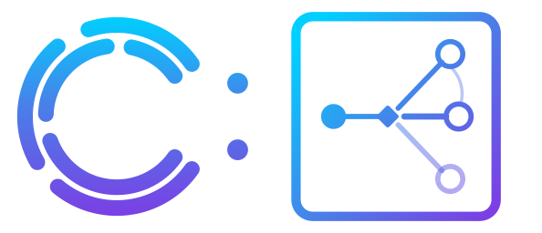
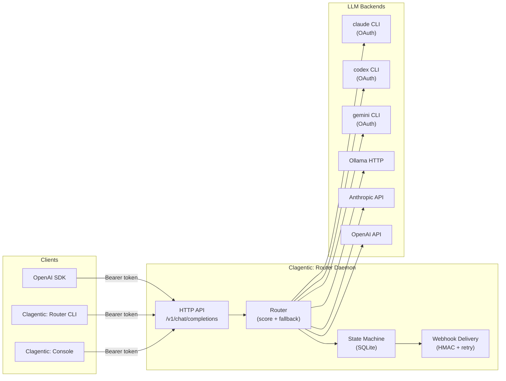

<p align="center">
  
</p>

<h4 align="center">LLM routing. Built for builders.</h4>

<p align="center">
  <a href="https://clagentic.ai"></a>
  <a href="LICENSE"></a>
  
  
  <a href="https://ko-fi.com/clagentic"></a>
</p>

A self-hosted LLM routing daemon with fallback chains, live quota intelligence, and an OpenAI-compatible HTTP API. Part of the [clagentic](https://clagentic.ai) suite.

## What it does

- Routes LLM calls across multiple backends (Claude CLI, Codex CLI, Gemini CLI, Ollama, Anthropic API, OpenAI API, AWS Bedrock)
- Walks a fallback chain when backends are unavailable or rate-limited
- Scores backends by health, quota pressure, latency EMA, and cost weight; near-ties broken by jitter
- Tracks quota/rate-limit state persistently in SQLite; auto-recovers when windows reset
- Parses `rate_limit_event` from the Claude CLI stream — captures live utilization, reset time, and bucket type on every response; persists to `quota_snapshots` table for historical analysis. `openai_api`/`anthropic_api` feed the same table via a synthetic utilization computed from their rate-limit headers; `gemini_cli`/`codex_cli` have no proactive quota signal today (documented, reactive-only — see their adapter files) and are not represented in `quota_snapshots`
- Exposes an OpenAI-compatible `/v1/chat/completions` endpoint — any OpenAI SDK works without changes; also exposes Anthropic Messages (`/v1/messages`) and Bedrock InvokeModel-shaped endpoints
- Delivers webhook alerts (HMAC-signed, exponential retry) on backend state changes
- Runs as a daemon on any Linux host; CLI adapters (`claude_cli`, `codex_cli`, `codex_subagent`, `gemini_cli`) require OAuth sessions on that host; API adapters (`anthropic_api`, `openai_api`, `bedrock_api`) work anywhere, including containers

## Documentation

This README is an orientation and link hub, not the manual. Full
documentation is split by audience so each stays focused:

| Doc | Audience | Covers |
|---|---|---|
| [docs/OPERATOR-GUIDE.md](docs/OPERATOR-GUIDE.md) | Human operator | Install, configure, add a backend, deploy (systemd/Docker/update), diagnose a failure, logging |
| [docs/AGENT-REFERENCE.md](docs/AGENT-REFERENCE.md) | Agent/integrator calling the daemon | Full API surface, adapter capability matrix, wire-field semantics, error taxonomy, routing invariants |
| [docs/BEDROCK.md](docs/BEDROCK.md) | Either | Every AWS Bedrock path: CLI-adapter Bedrock auth, `bedrock_api`, Bedrock InvokeModel HTTP endpoints |
| [`router.example.yaml`](router.example.yaml) | Either | Every config key, annotated with defaults and examples |
| [CLAUDE.md](CLAUDE.md) | Contributor editing this repo's Go source | Build-time contract: breadth principle, import graph, discovery-vs-hardcode rules, subprocess cwd/HOME contract |
| [docs/smoke-test.md](docs/smoke-test.md) | Human operator | End-to-end validation procedure against a live daemon |

`docs/AGENT-REFERENCE.md` states explicitly where its scope ends and
`CLAUDE.md`'s begins — read its "Boundary with CLAUDE.md" section before
adding to either, so the two contracts don't drift apart by duplicating
the same claim twice.

## Quick start

```bash
# 1. Build
make build

# 2. Configure
cp router.example.yaml router.yaml
$EDITOR router.yaml

# 3. Run
export CLAGENTIC_ROUTER_TOKEN=mysecret
./bin/clagentic-router serve --config router.yaml

# 4. Call it
export CLAGENTIC_ROUTER_TOKEN=mysecret
./bin/clagentic-router call --model claude-haiku --message "What is 2+2?"

# Or via any OpenAI SDK:
# base_url = "http://localhost:8765/v1"
# api_key  = "mysecret"
```

**Requirements:** Go 1.25+. No CGO — pure Go SQLite via `modernc.org/sqlite`.

Full install/configure/deploy walkthrough: [docs/OPERATOR-GUIDE.md](docs/OPERATOR-GUIDE.md).

## Design principle: breadth over single-path

Clagentic: Router exists to route across heterogeneous LLM backends, not to
serve one provider well. A feature that only works for one provider, one auth
mode, or one host is treated as incomplete. In practice this means:

- **Discover, don't hardcode.** Model/provider/project identifiers are
  resolved at runtime from the provider's own source of truth (e.g. the codex
  CLI's local config and model catalog) rather than typed into `router.yaml`.
  Static values remain available as explicit overrides.
- **Explicit config always wins.** If you set a value, it is used
  byte-identically and discovery is never attempted for it — safe to layer
  onto an existing deployment.
- **Named production paths stay stable.** The Claude brand account
  (`claude_cli`) and ChatGPT-Plus (`codex_cli`) are load-bearing; changes that
  improve one backend must not regress the others.

See [CLAUDE.md](CLAUDE.md) for the full principle and the reference
implementations; see [docs/AGENT-REFERENCE.md](docs/AGENT-REFERENCE.md) for
the wire-visible consequences (discovery is invisible to a caller by
design — this is repo-internal context, not something a client integrates
against).

## Architecture

Clagentic: Router is a self-hosted daemon. It accepts OpenAI-compatible requests, scores and selects backends via a pluggable adapter layer, walks a configurable fallback chain on failure, and persists health/quota state in SQLite.



## Import graph (no cycles allowed)

```
config  → (stdlib)
state   → (stdlib)
store   → state
backend → config
webhook → state, store
router  → backend, config, state, store, webhook
server  → router, state, store
cmd/clagentic-router → config, backend, router, server, store, webhook
```

Full contributor-facing detail (adding an import, error classification
internals, scoring formula, quota-alert edge-trigger mechanics) is in
[CLAUDE.md](CLAUDE.md).

## Build

```bash
make tidy     # go mod tidy
make build    # produces bin/clagentic-router
make install  # installs to GOBIN
make test     # go test ./...
make docker   # builds Docker image
```

## Support

If clagentic:router is useful to you: [ko-fi.com/clagentic](https://ko-fi.com/clagentic)

## Disclaimer

Not affiliated with Anthropic or OpenAI. Claude is a trademark of Anthropic. Codex is a
trademark of OpenAI. Provided "as is" without warranty. Users are responsible for
complying with their AI provider's terms of service.

## License

[FSL-1.1-MIT](LICENSE) — Functional Source License 1.1, with MIT as the Change License.

Free for personal, internal-business, evaluation, research, and non-commercial use.
Not free for offering this tool (or a substantial fork) as a competing commercial product.
Each release auto-converts to MIT on its second anniversary.
