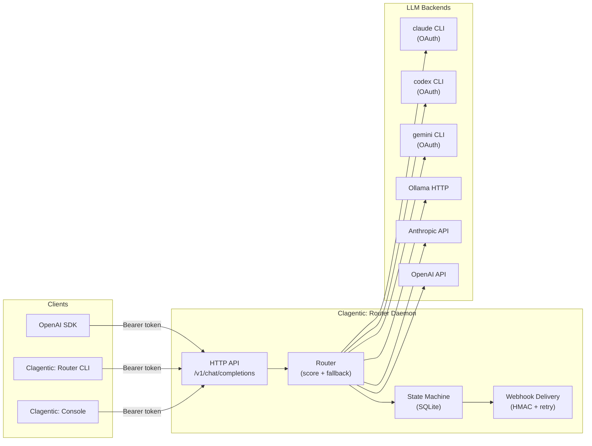

<p align="center">
  
</p>

<h4 align="center">LLM routing. Built for builders.</h4>

<p align="center">
  <a href="https://clagentic.ai"></a>
  <a href="LICENSE"></a>
  
  
  <a href="https://ko-fi.com/clagentic"></a>
</p>

A self-hosted LLM routing daemon with fallback chains, live quota intelligence, and an OpenAI-compatible HTTP API. Part of the [clagentic](https://clagentic.ai) suite.

## What it does

- Routes LLM calls across multiple backends (Claude CLI, Codex CLI, Ollama, Anthropic API, OpenAI API)
- Walks a fallback chain when backends are unavailable or rate-limited
- Scores backends by health, quota pressure, latency EMA, and cost weight; near-ties broken by jitter
- Tracks quota/rate-limit state persistently in SQLite; auto-recovers when windows reset
- Parses `rate_limit_event` from the Claude CLI stream — captures live utilization, reset time, and bucket type on every response; persists to `quota_snapshots` table for historical analysis
- Exposes an OpenAI-compatible `/v1/chat/completions` endpoint — any OpenAI SDK works without changes
- Delivers webhook alerts (HMAC-signed, exponential retry) on backend state changes
- Runs as a daemon on any Linux host; CLI adapters (`claude_cli`, `codex_cli`) require OAuth sessions on that host; API adapters work anywhere

## Quick start

```bash
# 1. Build
make build

# 2. Configure
cp router.example.yaml router.yaml
$EDITOR router.yaml

# 3. Run
export CLAGENTIC_ROUTER_TOKEN=mysecret
./bin/clagentic-router serve --config router.yaml

# 4. Call it
export CLAGENTIC_ROUTER_TOKEN=mysecret
./bin/clagentic-router call --model claude-haiku --message "What is 2+2?"

# Or via any OpenAI SDK:
# base_url = "http://localhost:8765/v1"
# api_key  = "mysecret"
```

**Requirements:** Go 1.25+. No CGO — pure Go SQLite via `modernc.org/sqlite`.

## Architecture

Clagentic: Router is a self-hosted daemon. It accepts OpenAI-compatible requests, scores and selects backends via a pluggable adapter layer, walks a configurable fallback chain on failure, and persists health/quota state in SQLite.



## Model field syntax

| Syntax | Example | Resolves to |
|---|---|---|
| Tier alias | `claude-haiku` | All backends in the `haiku` tier, scored |
| Explicit chain | `chain:haiku,mini,sonnet` | Three-step fallback |
| Named chain | `role:default` | Chain named `default` in config |
| Direct backend | `backend:claude-haiku` | Exactly one backend, no scoring |

## API

| Method | Path | Description |
|---|---|---|
| POST | /v1/chat/completions | OpenAI-compatible inference |
| GET | /v1/models | List all backends with status |
| GET | /v1/capacity | Per-backend capacity snapshot (utilization, reset time, score) |
| GET | /health | Aggregated health (cached) |
| GET | /doctor | Live probe of all backends |
| GET | /quota | Per-backend quota and rate state |
| GET | /metrics | Prometheus text format |
| GET | /logs | Recent call log (`?from=RFC3339&to=RFC3339`) |
| GET | /stats | Aggregated call statistics |
| POST | /backends/{id}/reset | Clear error state, re-probe |
| POST | /backends/{id}/disable | Force backend offline |
| POST | /backends/{id}/enable | Re-enable a disabled backend |
| POST | /webhooks | Register a webhook |
| DELETE | /webhooks/{id} | Remove a webhook |
| GET | /webhooks | List webhooks |
| GET | /version | Version (no auth required) |

All endpoints except `/version` require `Authorization: Bearer <token>`.

### Streaming

`/v1/chat/completions` accepts `"stream": true`. The response is delivered as
Server-Sent Events (SSE) in OpenAI wire format and is compatible with the OpenAI
Python SDK, openai-node, and any standard SSE client.

**Note:** the current implementation delivers the complete response as a single SSE
event (one content chunk followed by `[DONE]`). Token-by-token streaming is planned.

## Response headers

Every `/v1/chat/completions` response includes:

```
X-Router-Backend: claude-haiku
X-Router-Chain-Position: 0
X-Router-Latency-Ms: 1234
X-Router-Fallback-Reason: rate_limit   # only when chain was advanced
```

## Adapters

| Type | Auth | Notes |
|---|---|---|
| `claude_cli` | OAuth (keychain) | Requires `claude` binary on PATH; emits `rate_limit_event` with live utilization on every response — captured and persisted automatically; supports `quota_probe` config block to poll utilization on a configurable interval when idle |
| `codex_cli` | OAuth (keychain) | Requires `codex` binary on PATH |
| `codex_subagent` | OAuth (via Claude) | Requires Claude with codex agent installed |
| `gemini_cli` | OAuth (keychain) or `GEMINI_API_KEY` | Requires `gemini` binary on PATH; run `gemini auth login` |
| `ollama_http` | None | Local or remote Ollama server |
| `anthropic_api` | API key | Direct Anthropic Messages API |
| `openai_api` | API key | OpenAI Chat Completions API; optional `openai_api_key` enables usage polling |

CLI adapters (`claude_cli`, `codex_cli`, `codex_subagent`, `gemini_cli`) must run on the host where the OAuth sessions are stored. They cannot run in a container. For containerized deployment, use only API-based adapters.

## Webhook events

Webhooks are called via HTTP POST with a JSON body. Register endpoints in config or at runtime via `/webhooks`. Each delivery includes:

- `X-Clagentic-Event` — event name
- `X-Clagentic-Delivery` — unique delivery UUID
- `X-Clagentic-Signature` — `sha256=<hmac>` when `secret` is configured

| Event | Fired when |
|---|---|
| `backend_offline` | Backend exceeds `offline_failure_threshold` consecutive failures |
| `backend_degraded` | Backend exceeds `degraded_failure_threshold` consecutive failures |
| `backend_recovered` | Backend succeeds after being degraded or offline |
| `quota_exhausted` | Backend reports quota exhaustion (429 + quota header, or `QuotaExhausted` set) |
| `quota_low` | Estimated remaining quota drops below `quota_warning_threshold` (edge-triggered) |
| `auth_failure` | Backend returns 401/403 |
| `chain_exhausted` | All backends in the chain failed for a single request |

Delivery uses exponential backoff (default: 5 retries, initial 500 ms). Failed deliveries are logged and dropped after `webhook_max_retry` attempts.

## Logging

Every HTTP request is logged at `Info` level with `method`, `path`, `status`, `latency_ms`, and `request_id`. 5xx responses are logged at `Warn`. Backend state changes are logged at `Warn`. Verbose adapter traces are at `Debug`.

Every routed call is persisted to the `call_log` SQLite table with: `backend_id`, `model`, `outcome`, `prompt_tokens_est`, `completion_tokens_est`, `latency_ms`, `cost_usd_est`, `score` (router score at selection time), `request_id` (correlates to HTTP logs), `rate_limit_type` (active quota bucket), `utilization` (account utilization at routing time, if known), and `fallback_count` (backends tried before this hop). Query via `GET /logs`.

Quota events from `claude_cli` are additionally persisted to `quota_snapshots` with full `rate_limit_info` payload including `status`, `utilization`, `resets_at`, `surpassed_threshold`, and raw JSON for forward compatibility.

Configure log level and format in `router.yaml`:

```yaml
log:
  level: info    # debug|info|warn|error
  format: text   # text|json
```

Or at runtime via environment variables (override config):
- `CLAGENTIC_ROUTER_LOG_LEVEL=debug`
- `CLAGENTIC_ROUTER_LOG_FORMAT=json`

Use `format: json` for structured log ingestion (Loki, CloudWatch, Datadog).

## Configuration

See `router.example.yaml` for a fully annotated example.

Key concepts:
- **Backends**: one LLM invocation path each
- **Tiers**: named groups of backends at the same capability level (scored, pick best)
- **Chains**: ordered list of tiers to try in sequence on failure

### quota_probe (claude_cli backends)

When the router is idle, quota utilization and reset times for `claude_cli` backends go
stale. The `quota_probe` block activates a background loop that fires a minimal claude
CLI call when no organic `rate_limit_event` has been received within the configured window.

```yaml
backends:
  claude-low:
    adapter: claude_cli
    model: claude-haiku-4-5
    quota_probe:
      enabled: true       # false by default; must opt in
      interval: 30m       # probe if no organic data in this window (default: 30m)
      model: claude-haiku-4-5  # model to use for the probe ping (default: claude-haiku-4-5)
```

| Field | Type | Default | Description |
|---|---|---|---|
| `enabled` | bool | `false` | Activate the probe loop |
| `interval` | duration string | `30m` | How long to wait without organic data before probing |
| `model` | string | `claude-haiku-4-5` | Model to use for the probe call (use the cheapest available) |

Probe calls are not recorded in `/logs` or `/stats` — they are maintenance traffic, not
routed requests. On a `rejected` status (quota exhausted), the prober backs off to a
5-minute retry interval until it receives a non-rejected response.

## Deployment

### Systemd

```ini
[Unit]
Description=Clagentic: Router LLM routing daemon
After=network.target

[Service]
ExecStart=/usr/local/bin/clagentic-router serve
Restart=always
EnvironmentFile=/etc/clagentic/router/env
User=router

[Install]
WantedBy=multi-user.target
```

### Docker (API-only mode)

```bash
docker run -p 8765:8765 \
  -v /etc/clagentic/router/router.yaml:/etc/clagentic/router/router.yaml:ro \
  -e CLAGENTIC_ROUTER_TOKEN=secret \
  -e ANTHROPIC_API_KEY=sk-... \
  clagentic-router
```

## Build

```bash
make tidy     # go mod tidy
make build    # produces bin/clagentic-router
make install  # installs to GOBIN
make test     # go test ./...
make docker   # builds Docker image
```

## Support

If clagentic:router is useful to you: [ko-fi.com/clagentic](https://ko-fi.com/clagentic)

## Disclaimer

Not affiliated with Anthropic or OpenAI. Claude is a trademark of Anthropic. Codex is a
trademark of OpenAI. Provided "as is" without warranty. Users are responsible for
complying with their AI provider's terms of service.

## License

[FSL-1.1-MIT](LICENSE) — Functional Source License 1.1, with MIT as the Change License.

Free for personal, internal-business, evaluation, research, and non-commercial use.
Not free for offering this tool (or a substantial fork) as a competing commercial product.
Each release auto-converts to MIT on its second anniversary.
