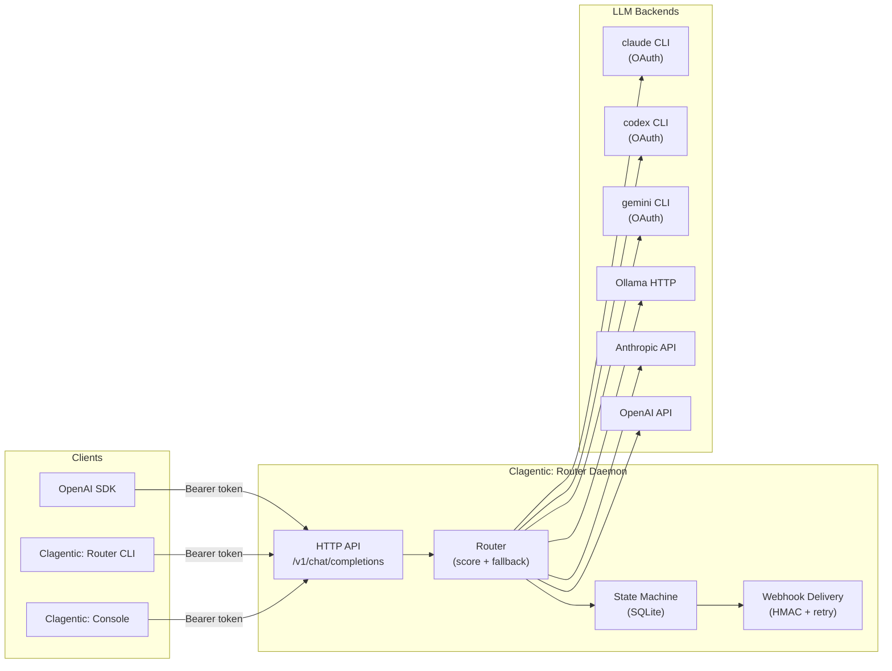

<p align="center">
  
</p>

<h4 align="center">LLM routing. Built for builders.</h4>

<p align="center">
  <a href="https://clagentic.ai"></a>
  <a href="LICENSE"></a>
  
  
  <a href="https://ko-fi.com/clagentic"></a>
</p>

A self-hosted LLM routing daemon with fallback chains, live quota intelligence, and an OpenAI-compatible HTTP API. Part of the [clagentic](https://clagentic.ai) suite.

## What it does

- Routes LLM calls across multiple backends (Claude CLI, Codex CLI, Ollama, Anthropic API, OpenAI API, AWS Bedrock)
- Walks a fallback chain when backends are unavailable or rate-limited
- Scores backends by health, quota pressure, latency EMA, and cost weight; near-ties broken by jitter
- Tracks quota/rate-limit state persistently in SQLite; auto-recovers when windows reset
- Parses `rate_limit_event` from the Claude CLI stream — captures live utilization, reset time, and bucket type on every response; persists to `quota_snapshots` table for historical analysis
- Exposes an OpenAI-compatible `/v1/chat/completions` endpoint — any OpenAI SDK works without changes
- Delivers webhook alerts (HMAC-signed, exponential retry) on backend state changes
- Runs as a daemon on any Linux host; CLI adapters (`claude_cli`, `codex_cli`) require OAuth sessions on that host; API adapters work anywhere

## Design principle: breadth over single-path

Clagentic: Router exists to route across heterogeneous LLM backends, not to
serve one provider well. A feature that only works for one provider, one auth
mode, or one host is treated as incomplete. In practice this means:

- **Discover, don't hardcode.** Model/provider/project identifiers are
  resolved at runtime from the provider's own source of truth (e.g. the codex
  CLI's local config and model catalog) rather than typed into `router.yaml`.
  Static values remain available as explicit overrides.
- **Explicit config always wins.** If you set a value, it is used
  byte-identically and discovery is never attempted for it — safe to layer
  onto an existing deployment.
- **Named production paths stay stable.** The Claude brand account
  (`claude_cli`) and ChatGPT-Plus (`codex_cli`) are load-bearing; changes that
  improve one backend must not regress the others.

See `CLAUDE.md` for the full principle and the reference implementations.

## Quick start

```bash
# 1. Build
make build

# 2. Configure
cp router.example.yaml router.yaml
$EDITOR router.yaml

# 3. Run
export CLAGENTIC_ROUTER_TOKEN=mysecret
./bin/clagentic-router serve --config router.yaml

# 4. Call it
export CLAGENTIC_ROUTER_TOKEN=mysecret
./bin/clagentic-router call --model claude-haiku --message "What is 2+2?"

# Or via any OpenAI SDK:
# base_url = "http://localhost:8765/v1"
# api_key  = "mysecret"
```

**Requirements:** Go 1.25+. No CGO — pure Go SQLite via `modernc.org/sqlite`.

## Architecture

Clagentic: Router is a self-hosted daemon. It accepts OpenAI-compatible requests, scores and selects backends via a pluggable adapter layer, walks a configurable fallback chain on failure, and persists health/quota state in SQLite.



## Model field syntax

| Syntax | Example | Resolves to |
|---|---|---|
| Tier alias | `claude-haiku` | All backends in the `haiku` tier, scored |
| Explicit chain | `chain:haiku,mini,sonnet` | Three-step fallback |
| Named chain | `role:default` | Chain named `default` in config |
| Direct backend | `backend:claude-haiku` | Exactly one backend, no scoring |

## API

| Method | Path | Description |
|---|---|---|
| POST | /v1/chat/completions | OpenAI-compatible inference |
| POST | /v1/messages | Anthropic Messages API — passthrough or `role:*` routed (see below) |
| POST | /model/{modelId}/invoke | AWS Bedrock Runtime InvokeModel — passthrough or `role:*` routed (see below) |
| POST | /model/{modelId}/invoke-with-response-stream | AWS Bedrock Runtime InvokeModelWithResponseStream — passthrough or `role:*` routed (see below) |
| GET | /v1/models | List all backends with status and capabilities |
| GET | /v1/capacity | Per-backend capacity snapshot (utilization, reset time, score) |
| GET | /health | Aggregated health (cached) |
| GET | /doctor | Live probe of all backends |
| GET | /quota | Per-backend quota and rate state |
| GET | /metrics | Prometheus text format |
| GET | /logs | Recent call log (`?from=RFC3339&to=RFC3339`) |
| GET | /stats | Aggregated call statistics |
| POST | /backends/{id}/reset | Clear error state, re-probe |
| POST | /backends/{id}/disable | Force backend offline |
| POST | /backends/{id}/enable | Re-enable a disabled backend |
| POST | /webhooks | Register a webhook |
| DELETE | /webhooks/{id} | Remove a webhook |
| GET | /webhooks | List webhooks |
| GET | /version | Version (no auth required) |

All endpoints except `/version` require `Authorization: Bearer <token>` — with two
exceptions: `/v1/messages` and `/model/{modelId}/invoke[-with-response-stream]` in
passthrough mode, see below.

## Anthropic Messages API

`POST /v1/messages` lets `ANTHROPIC_BASE_URL`-configurable clients — Claude Code
among them — point at the router directly. Because `ANTHROPIC_BASE_URL` is
process-global in Claude Code (the whole session routes through it, orchestrator
included), the endpoint has two modes, selected by the request's `model` field:

| Model field | Mode | Behavior |
|---|---|---|
| Any normal Claude model (`claude-sonnet-4-6`, etc.) | **Passthrough** (default) | Transparent reverse proxy to `anthropic.upstream_url` (default `https://api.anthropic.com`). Request body and streamed SSE are forwarded byte-for-byte — tools, prompt caching, and multimodal content pass through untouched. |
| `role:<chain>` / `chain:a,b,c` / `backend:<id>` | **Routed** | Translated to the router's internal request format, sent through the same fallback-chain machinery as `/v1/chat/completions`, translated back to Anthropic Messages format (including Anthropic-grammar SSE when `stream: true`). |

### Auth matrix (deliberately asymmetric)

- **Passthrough mode**: the router does **not** check its own inference token.
  The client's own Anthropic credential (`x-api-key` or `Authorization: Bearer`)
  travels through to the upstream Anthropic API unchanged — Anthropic
  authenticates the call, not the router. This is what keeps an interactive
  Claude Code session fully functional when pointed at the router: the client
  only ever needs to know its own Anthropic key, not a separate router token.
  Set `anthropic.upstream_api_key` to instead substitute a router-owned key for
  every passthrough request, overriding whatever the client sent.
- **Routed mode**: requires the router's own inference token, presented as
  `x-api-key: <token>` OR `Authorization: Bearer <token>` — this is a real
  router-owned invocation (chain selection, metering) and is gated exactly
  like `/v1/chat/completions`.

### Known limitation — routed mode only

Routed models lose true token streaming — the router's CLI adapters are
request/response, not streaming — and, as of this writing, no adapter
round-trips tool_use/tool_result content on a routed *multi-turn* call. This
makes routed mode suitable for **one-shot review/audit roles**
(`role:reviewer-chain`, `role:auditor-chain` — see `router.example.yaml`).
Passthrough mode has none of these limitations — it is a byte-for-byte proxy.

**Tool-bearing requests are refused, never silently degraded.** If a routed
request's `tools` field is present and the resolved chain has no
tool-capable backend (see [Adapter capabilities](#adapter-capabilities)
below), the router returns `422 no_tool_capable_backend` naming the reason —
it never returns a `200` with the tools silently dropped. As of this
writing, **no configured adapter declares `supports_tools: true`**: every
adapter's own wire code sends plain-text messages and reads plain-text
responses only, so every routed tool-bearing request is refused today,
regardless of which chain it targets. Use passthrough mode for tool-using
clients — it forwards tools untouched.

**Working directory (`working_dir`).** Both `/v1/messages` (routed mode
only) and `/v1/chat/completions` accept an optional `working_dir` field: an
absolute path the four subprocess (CLI) adapters (`claude_cli`, `codex_cli`,
`codex_subagent`, `gemini_cli`) use as the subprocess's working directory.
It is opt-in and never inferred from server-side state — the router is a
shared daemon serving arbitrary callers, so guessing a directory server-side
would just be a different flavor of the bug this field exists to avoid.
When omitted, all four subprocess adapters default to `/`. A supplied value
is validated at the wire boundary and rejected with `400`
(Anthropic-format `invalid_request_error` on `/v1/messages`,
`invalid_request` on `/v1/chat/completions`) unless it is absolute, exists,
and is a directory — an invalid path is refused outright rather than
silently ignored or left to fail opaquely inside the subprocess exec. The
three HTTP adapters (`anthropic_api`, `openai_api`, `bedrock_api`) have no
subprocess and ignore this field entirely.

### Adapter capabilities

`GET /v1/models` includes a `capabilities` object per backend so a caller can
check tool/streaming/image support **before** sending a request:

```json
{
  "id": "claude-api",
  "capabilities": {
    "supports_tools": false,
    "supports_streaming": false,
    "supports_images": false
  }
}
```

Every adapter today declares `supports_tools: false` and
`supports_images: false` — not because the underlying provider APIs lack
tool/vision support, but because none of this router's adapters currently
marshal a `tools` field or a non-text content block on the request, or parse
one back out of the response (each adapter's `Capabilities()` doc explains
its specific gap). `Capabilities()` exists as the honest, queryable signal
of that state and the seam a future adapter would flip to `true` once it
actually wires tool passthrough — not a router-level translation flag.

### Config

```yaml
anthropic:
  upstream_url: ""        # default: https://api.anthropic.com
  # upstream_api_key: env:ANTHROPIC_API_KEY   # optional router-owned key override
```

## AWS Bedrock InvokeModel API

`POST /model/{modelId}/invoke` and `POST /model/{modelId}/invoke-with-response-stream`
let Bedrock-mode Claude Code (`CLAUDE_CODE_USE_BEDROCK=1`, `ANTHROPIC_BEDROCK_BASE_URL`
pointed at the router) work the same way `/v1/messages` works for direct-API mode.
The key difference from `/v1/messages`: **the model identifier is carried entirely by
the URL path segment, never the request body** — there is no `model` field in a Bedrock
InvokeModel request. That path segment (`{modelId}`) is the routing key, exactly as with
`/v1/messages`'s body `model` field:

| `{modelId}` | Mode | Behavior |
|---|---|---|
| A real Bedrock model/inference-profile ID (`anthropic.claude-...`, `us.anthropic.claude-...`) | **Passthrough** (default) | SigV4-signed reverse proxy to the real AWS Bedrock Runtime endpoint for `bedrock.region`. Request body and response (including AWS event-stream-framed responses) are forwarded byte-for-byte. |
| `role:<chain>` / `chain:a,b,c` / `backend:<id>` | **Routed** | Translated to the router's internal request format, sent through the same fallback-chain machinery as `/v1/chat/completions` and `/v1/messages`, translated back into the Bedrock InvokeModel response envelope — which is byte-identical in shape to the direct Anthropic Messages response for Anthropic models on Bedrock. |

### Auth matrix

Same asymmetric shape as `/v1/messages`:

- **Passthrough mode**: the router does **not** check its own inference token — Bedrock
  passthrough is authenticated by SigV4 signing with AWS credentials the router itself
  resolves (see Config below), not by any credential the client presents.
- **Routed mode**: requires the router's own inference token, presented as
  `x-api-key: <token>` OR `Authorization: Bearer <token>`.

### Tools

Same refusal behavior as `/v1/messages` routed mode: if the request body's
`tools` field is present and the resolved chain has no tool-capable backend
(see [Adapter capabilities](#adapter-capabilities)), the router returns
`422` (Bedrock error envelope: `{"message": "..."}`) rather than a `200`
with tools silently dropped. Passthrough forwards `tools` untouched — this
check only applies to `role:*`/`chain:*`/`backend:*` model IDs.

### Config

```yaml
bedrock:
  region: us-east-1        # required for passthrough; routed-mode-only deployments may omit
  # profile: my-aws-profile  # optional named AWS profile for passthrough credential resolution
```

Credentials for passthrough are resolved via the same standard AWS SDK credential chain
the `bedrock_api` adapter uses (env vars → web identity → shared credentials file →
shared config file → ECS → IMDS) — see [AWS Bedrock (`bedrock_api`)](#aws-bedrock-bedrock_api)
below for the full credential/region discussion. A passthrough request with no
`bedrock.region` configured fails with `503` rather than attempting to sign with an
empty region.

### Streaming framing

The streaming variant emits **AWS event-stream framing**
(`Content-Type: application/vnd.amazon.eventstream`) — a third response-framing scheme
distinct from both plain SSE (`/v1/chat/completions`) and the Anthropic Messages SSE
grammar (`/v1/messages` routed mode). Passthrough forwards the upstream event-stream
bytes unmodified; routed mode constructs event-stream frames itself (via the AWS SDK's
own `aws/protocol/eventstream` codec, not hand-rolled), one frame per Anthropic-grammar
event (`message_start`, `content_block_delta`, etc.) — same known routed-mode limitation
as `/v1/messages`: the full response arrives in one `content_block_delta` frame rather
than true token-by-token streaming.

### Verification status

The routed-mode path (path extraction, request/response translation, event-stream
encode/decode) is unit-tested deterministically and requires no AWS account. The
passthrough path's request-building and SigV4 signing are unit-tested against an
`httptest` stand-in with injected stub credentials — this verifies the signing call
shape and header production, but **does not** verify AWS itself accepts the signed
request end-to-end. No live AWS Bedrock account was available during this endpoint's
development (same caveat as the `bedrock_api` adapter below); live verification against
a real Bedrock endpoint is left to the operator enabling Bedrock passthrough.

### Streaming

`/v1/chat/completions` accepts `"stream": true`. The response is delivered as
Server-Sent Events (SSE) in OpenAI wire format and is compatible with the OpenAI
Python SDK, openai-node, and any standard SSE client.

**Note:** the current implementation delivers the complete response as a single SSE
event (one content chunk followed by `[DONE]`). Token-by-token streaming is planned.

### Tools

`/v1/chat/completions` accepts an OpenAI-shaped `tools` field. If `tools` is
present and non-empty and the resolved chain has no tool-capable backend
(see [Adapter capabilities](#adapter-capabilities)), the request is refused
with `422 no_tool_capable_backend` rather than routed to a backend that would
silently drop the tools.

## Response headers

Every `/v1/chat/completions` response includes:

```
X-Router-Backend: claude-haiku
X-Router-Chain-Position: 0
X-Router-Latency-Ms: 1234
X-Router-Fallback-Reason: rate_limit   # only when chain was advanced
```

## Adapters

| Type | Auth | Notes |
|---|---|---|
| `claude_cli` | OAuth (keychain) | Requires `claude` binary on PATH; emits `rate_limit_event` with live utilization on every response — captured and persisted automatically; supports `quota_probe` config block to poll utilization on a configurable interval when idle |
| `codex_cli` | OAuth (keychain) | Requires `codex` binary on PATH |
| `codex_subagent` | OAuth (via Claude) | Requires Claude with codex agent installed |
| `gemini_cli` | OAuth (keychain) or `GEMINI_API_KEY` | Requires `gemini` binary on PATH; run `gemini auth login` |
| `ollama_http` | None | Local or remote Ollama server |
| `anthropic_api` | API key | Direct Anthropic Messages API |
| `openai_api` | API key | OpenAI Chat Completions API; optional `openai_api_key` enables usage polling |
| `bedrock_api` | AWS SDK credential chain | AWS Bedrock Converse API — see [AWS Bedrock (`bedrock_api`)](#aws-bedrock-bedrock_api) below |

CLI adapters (`claude_cli`, `codex_cli`, `codex_subagent`, `gemini_cli`) must run on the host where the OAuth sessions are stored. They cannot run in a container. For containerized deployment, use only API-based adapters.

### AWS Bedrock (`bedrock_api`)

Calls the [Bedrock Runtime Converse API](https://docs.aws.amazon.com/bedrock/latest/APIReference/API_runtime_Converse.html),
which is uniform across model families for text-only, non-streaming
invocation — the same adapter covers both the Anthropic and OpenAI families
hosted on Bedrock with no model-family-specific config. Image input,
streaming, and tool-use content blocks are out of scope for this adapter;
text-only requests/responses only. Non-text response content blocks (tool
use, reasoning, etc.) are skipped rather than causing an error.

```yaml
backends:
  bedrock-claude:
    adapter: bedrock_api
    region: us-east-1                      # required — Bedrock has no SDK default region
    model: anthropic.claude-sonnet-4-6-v1:0  # confirm the exact ID in the Bedrock console
    # profile: my-aws-profile              # optional named AWS profile
    timeout_seconds: 180
```

**Credentials.** Resolved exclusively via the standard AWS SDK credential
chain (env vars → web identity → shared credentials file → shared config
file → ECS → IMDS) — the same chain `aws-cli` and every other AWS SDK use.
There is no `api_key` field for this adapter and router.yaml must never
carry AWS credentials; set `AWS_ACCESS_KEY_ID`/`AWS_SECRET_ACCESS_KEY` (or
better, a role) in the environment, or use `profile` to select a named
profile from `~/.aws/config` / `~/.aws/credentials`.

**Region.** Required — Bedrock has no default region in the SDK. An empty
`region` fails config validation at startup rather than failing on the
first call.

**Model ID semantics.** Two ID forms exist and they are *not*
interchangeable:
- **Bare model IDs** (e.g. `anthropic.claude-sonnet-4-6-v1:0`) are
  region-specific — the model must be enabled for that exact region in your
  account.
- **Region-prefixed inference profile IDs** (e.g. `us.anthropic.claude-...`,
  `eu.anthropic.claude-...`) enable cross-region routing with failover, and
  some models are reachable *only* via an inference profile.

Check the Bedrock console for your target model to determine which form it
requires. The Anthropic family's Bedrock IDs are well-documented; **the
exact ID strings for the OpenAI family hosted on Bedrock were not confirmed
during this adapter's development** — do not copy an ID from this README
for an OpenAI-family model without first verifying it in the console for
your account/region.

**Error classification.** Bedrock Runtime SDK exceptions are mapped onto
the router's existing `ErrorType` enum via `errors.As` (never string
matching): `ThrottlingException`/`ModelNotReadyException` → rate limit,
`AccessDeniedException` → auth (covers both missing/expired credentials
*and* a model not enabled for your account — both surface as the same SDK
exception type), `ValidationException`/`ResourceNotFoundException` →
schema, `ModelTimeoutException` → timeout, and
`ModelErrorException`/`InternalServerException`/`ServiceUnavailableException`
→ network (retriable downstream failure).

**Operator-verifiable, not verified here.** This adapter was built and
tested entirely against a mocked Bedrock client — no live AWS account was
available in the build environment. Live end-to-end verification against a
real Bedrock endpoint (credential resolution, an actual Converse call
succeeding, and the OpenAI-family model ID question above) is left to the
operator enabling this backend against their own AWS account.

## Webhook events

Webhooks are called via HTTP POST with a JSON body. Register endpoints in config or at runtime via `/webhooks`. Each delivery includes:

- `X-Clagentic-Event` — event name
- `X-Clagentic-Delivery` — unique delivery UUID
- `X-Clagentic-Signature` — `sha256=<hmac>` when `secret` is configured

| Event | Fired when |
|---|---|
| `backend_offline` | Backend exceeds `offline_failure_threshold` consecutive failures |
| `backend_degraded` | Backend exceeds `degraded_failure_threshold` consecutive failures |
| `backend_recovered` | Backend succeeds after being degraded or offline |
| `quota_exhausted` | Backend reports quota exhaustion (429 + quota header, or `QuotaExhausted` set) |
| `quota_low` | Estimated remaining quota drops below `quota_warning_threshold` (edge-triggered) |
| `auth_failure` | Backend returns 401/403 |
| `chain_exhausted` | All backends in the chain failed for a single request |

Delivery uses exponential backoff (default: 5 retries, initial 500 ms). Failed deliveries are logged and dropped after `webhook_max_retry` attempts.

## Logging

Every HTTP request is logged at `Info` level with `method`, `path`, `status`, `latency_ms`, and `request_id`. 5xx responses are logged at `Warn`. Backend state changes are logged at `Warn`. Verbose adapter traces are at `Debug`.

Every routed call is persisted to the `call_log` SQLite table with: `backend_id`, `model`, `outcome`, `prompt_tokens_est`, `completion_tokens_est`, `latency_ms`, `cost_usd_est`, `score` (router score at selection time), `request_id` (correlates to HTTP logs), `rate_limit_type` (active quota bucket), `utilization` (account utilization at routing time, if known), and `fallback_count` (backends tried before this hop). Query via `GET /logs`.

Quota events from `claude_cli` are additionally persisted to `quota_snapshots` with full `rate_limit_info` payload including `status`, `utilization`, `resets_at`, `surpassed_threshold`, and raw JSON for forward compatibility.

Configure log level and format in `router.yaml`:

```yaml
log:
  level: info    # debug|info|warn|error
  format: text   # text|json
```

Or at runtime via environment variables (override config):
- `CLAGENTIC_ROUTER_LOG_LEVEL=debug`
- `CLAGENTIC_ROUTER_LOG_FORMAT=json`

Use `format: json` for structured log ingestion (Loki, CloudWatch, Datadog).

## Configuration

See `router.example.yaml` for a fully annotated example.

Key concepts:
- **Backends**: one LLM invocation path each
- **Tiers**: named groups of backends at the same capability level (scored, pick best)
- **Chains**: ordered list of tiers to try in sequence on failure

### quota_probe (claude_cli backends)

When the router is idle, quota utilization and reset times for `claude_cli` backends go
stale. The `quota_probe` block activates a background loop that fires a minimal claude
CLI call when no organic `rate_limit_event` has been received within the configured window.

```yaml
backends:
  claude-low:
    adapter: claude_cli
    model: claude-haiku-4-5
    quota_probe:
      enabled: true       # false by default; must opt in
      interval: 30m       # probe if no organic data in this window (default: 30m)
      model: claude-haiku-4-5  # model to use for the probe ping (default: claude-haiku-4-5)
```

| Field | Type | Default | Description |
|---|---|---|---|
| `enabled` | bool | `false` | Activate the probe loop |
| `interval` | duration string | `30m` | How long to wait without organic data before probing |
| `model` | string | `claude-haiku-4-5` | Model to use for the probe call (use the cheapest available) |

Probe calls are not recorded in `/logs` or `/stats` — they are maintenance traffic, not
routed requests. On a `rejected` status (quota exhausted), the prober backs off to a
5-minute retry interval until it receives a non-rejected response.

## Deployment

### Systemd

A fully annotated sample unit is in [`deploy/clagentic-router.service`](deploy/clagentic-router.service).

**HOME is required.** The `claude_cli` adapter resolves OAuth credentials from
`$HOME/.claude/.credentials.json`. Systemd does not set `HOME` for service units by
default. If it is unset, credential sync fails with an ERROR log and all `claude_cli`
backends are permanently unauthenticated. Set `HOME` to the home directory of the user
the service runs as:

```ini
[Unit]
Description=Clagentic: Router LLM routing daemon
After=network.target

[Service]
User=router
# HOME must match the User above so the claude_cli adapter can locate OAuth credentials.
# Adjust to /root, /home/ubuntu, etc. depending on which user owns the Claude session.
Environment=HOME=/home/router
ExecStart=/usr/local/bin/clagentic-router serve --config /etc/clagentic/router/router.yaml
Restart=on-failure
EnvironmentFile=/etc/clagentic/router/env

[Install]
WantedBy=multi-user.target
```

If you use only API-based adapters (`anthropic_api`, `openai_api`) and do not configure
any `claude_cli` backends, this requirement does not apply.

### Redeploying: `clagentic-router update`

The router is a long-running daemon — landing a change in git does not make it live.
`clagentic-router update` rebuilds the binary from source, installs it atomically (stage
+ rename, never an in-place copy over the running binary — avoids "text file busy"), and
restarts the service. It reuses the same config file `serve` uses (no second config
surface); every setting is optional and defaults to a stock systemd install:

```yaml
deploy:
  source_dir: .                                   # module root to build from (default: cwd)
  install_path: /usr/local/bin/clagentic-router    # path the running service execs
  service_name: clagentic-router                   # systemd unit name, without .service
  service_manager: systemd                         # systemd | none (install only, no restart)
```

```bash
clagentic-router update                # uses the resolved config (see "Configuration")
clagentic-router update --config PATH   # explicit config path
```

This is the command a project's `.crew/naomi.yaml` `post_merge_steps` should invoke as a
bare, environment-agnostic verb — all host-specific detail lives in `router.yaml`'s
`[deploy]` block, not in the committed post-merge step.

### Docker (API-only mode)

```bash
docker run -p 8765:8765 \
  -v /etc/clagentic/router/router.yaml:/etc/clagentic/router/router.yaml:ro \
  -e CLAGENTIC_ROUTER_TOKEN=secret \
  -e ANTHROPIC_API_KEY=sk-... \
  clagentic-router
```

## Build

```bash
make tidy     # go mod tidy
make build    # produces bin/clagentic-router
make install  # installs to GOBIN
make test     # go test ./...
make docker   # builds Docker image
```

## Support

If clagentic:router is useful to you: [ko-fi.com/clagentic](https://ko-fi.com/clagentic)

## Disclaimer

Not affiliated with Anthropic or OpenAI. Claude is a trademark of Anthropic. Codex is a
trademark of OpenAI. Provided "as is" without warranty. Users are responsible for
complying with their AI provider's terms of service.

## License

[FSL-1.1-MIT](LICENSE) — Functional Source License 1.1, with MIT as the Change License.

Free for personal, internal-business, evaluation, research, and non-commercial use.
Not free for offering this tool (or a substantial fork) as a competing commercial product.
Each release auto-converts to MIT on its second anniversary.
